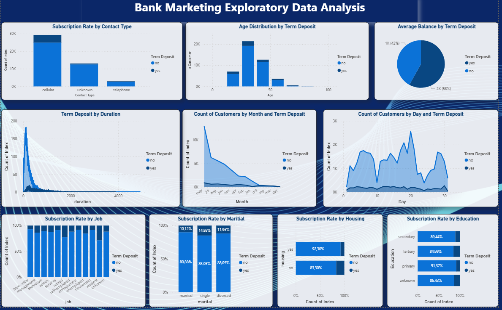

# 🏦 Bank Marketing Exploratory Data Analysis

This dashboard provides a deep exploratory analysis of customer data related to a bank's direct marketing campaigns, specifically focusing on the factors that influence the subscription to a term deposit. The visualizations help identify key customer segments and temporal trends for optimizing future marketing efforts.

## Dashboard Key Focus & Objectives

The primary goal of this analysis is to understand the correlation between various demographic, contact, and temporal features with the decision to subscribe to a term deposit.

- **Key Indicator:** Term Deposit Subscription Rate  
- **Data Scope:** Analysis of contact type, age, job, marital status, housing, and education  

## Core Analysis Areas

| Section | Description | Key Visuals |
|--------|-------------|-------------|
| **Subscription Drivers** | Analysis of the subscription rate segmented by key customer attributes like **Job**, **Marital Status**, **Housing**, and **Education** to find successful segments. | Stacked Bar Charts, Bar Charts |
| **Campaign Logistics** | Examination of the **Contact Type** used in the campaign and the distribution of subscriptions across the **Day** and **Month** of contact. | Bar Charts, Area Chart |
| **Customer Profile** | Distribution of the customer base by **Age** and analysis of the **Average Balance** by term deposit status. | Bar Chart, Pie Chart |
| **Time Factor** | Analysis of the **Duration** of the last contact and its strong relationship with term deposit subscriptions. | Area Plot |

## Data Sources

- Bank Marketing Campaign Data (typically based on phone calls)  
- Customer Demographic Data  

## Technical Details

This dashboard was developed using **Power BI Desktop**. It relies heavily on visualization best practices for exploratory data analysis, utilizing various chart types to compare the subscribed population against the non-subscribed population.

---

## 📸 Dashboard Screenshot

