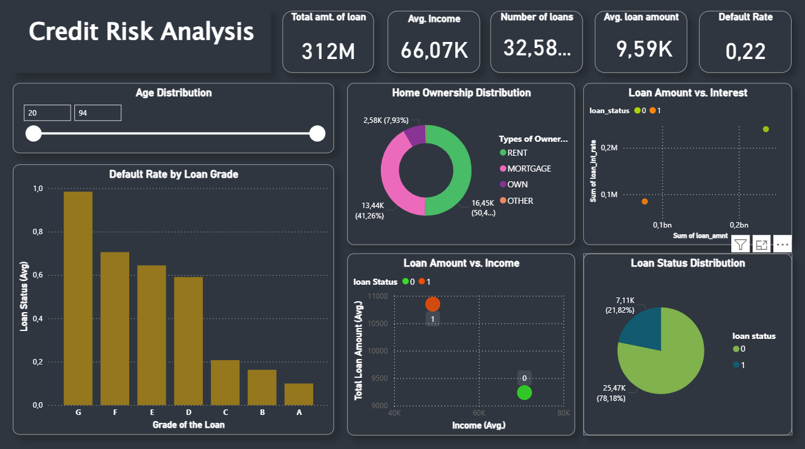

# 💰 Credit Risk Analysis Dashboard

This dashboard is designed to provide comprehensive insights into the bank's lending portfolio and associated credit risk. It allows analysts to track key indicators related to loan performance, customer demographics, and the factors contributing to default rates.

## Dashboard Key Metrics & Objectives

The primary goal is to quantify risk exposure and identify the highest risk segments within the loan portfolio.

- **Total Amount of Loan:** **312M**  
- **Total Number of Loans:** **32.58K**  
- **Average Income:** **66.07K**  
- **Default Rate:** **0.22**  

## Core Analysis Areas

| Section | Description | Key Visuals |
|--------|-------------|-------------|
| **Risk Segmentation** | Analysis of the **Default Rate by Loan Grade** (A to G), serving as a primary indicator for modeling risk and pricing. | Bar Chart |
| **Loan Status & Distribution** | Overview of total portfolio distribution by **Loan Status** (0 - Non-default, 1 - Default). | Donut Chart |
| **Customer Demographics** | Distribution of the customer base by **Home Ownership** status (Rent, Mortgage, Own, Other), and interactive **Age Distribution** filter. | Donut Chart, Slicer |
| **Correlation Analysis** | Examination of relationships between key variables such as **Loan Amount vs. Income** and **Loan Amount vs. Interest** to spot anomalies and policy breaches. | Scatter Plots |

## Data Sources

- Financial Loan Portfolio Data  
- Customer Demographic and Credit History Data  

## Technical Details

This dashboard was developed using **Power BI Desktop**. It is structured for risk management professionals, providing dynamic analysis across loan grades and customer characteristics.

---

## 📸 Dashboard Screenshot

