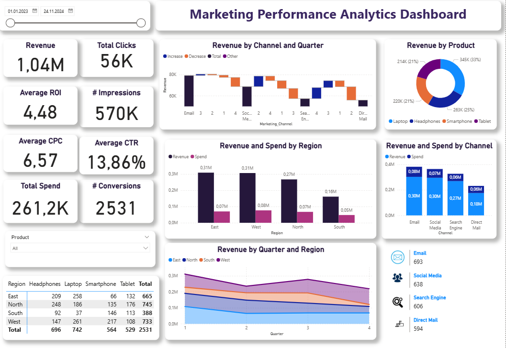

# 📈 Marketing Performance Analytics Dashboard

This dashboard serves as a central hub for tracking, analyzing, and optimizing digital marketing campaign performance. It provides a real-time (or near real-time) view of critical metrics, allowing stakeholders to assess profitability, channel effectiveness, and regional performance.

## Dashboard Key Metrics & Objectives

The primary goal is to ensure marketing spend is effective, focusing on the relationship between investment (Spend/CPC) and returns (Revenue/Conversions/ROI).

- **Revenue:** **1.04M**  
- **Total Spend:** **261.2K**  
- **Average ROI:** **4.48**  
- **Total Conversions:** **2,531**  
- **Total Clicks:** **56K**  
- **Average CTR:** **13.86%**  

## Core Analysis Areas

| Section | Description | Key Visuals |
|--------|-------------|-------------|
| **Channel Effectiveness** | Analysis of **Revenue by Channel and Quarter**, highlighting which sources drive the most profitable growth. Compares **Revenue vs. Spend by Channel**. | Waterfall/Stacked Bar Chart, Bar Chart |
| **Regional Performance** | Comparative view of **Revenue and Spend by Region**, with detailed breakdown of **Revenue by Quarter and Region** to identify geographical strengths and seasonality. | Bar Chart, Area Chart |
| **Product Analysis** | Breakdown of **Revenue by Product** (Laptop, Headphones, Smartphone, Tablet) to understand which offerings perform best. | Donut Chart, Table |
| **Funnels** | Tracking the top-level marketing funnel metrics (Impressions → Clicks → Conversions). | KPI Cards |

## Data Sources

- Digital Marketing Platform APIs (e.g., Google Ads, Social Media Platforms)  
- CRM and Sales Transaction Data  

## Technical Details

This dashboard was developed using **Power BI Desktop**. It features advanced analysis across multiple dimensions (Channel, Region, Product, Quarter) and utilizes clear KPI cards for immediate performance monitoring.

---

## 📸 Dashboard Screenshot

