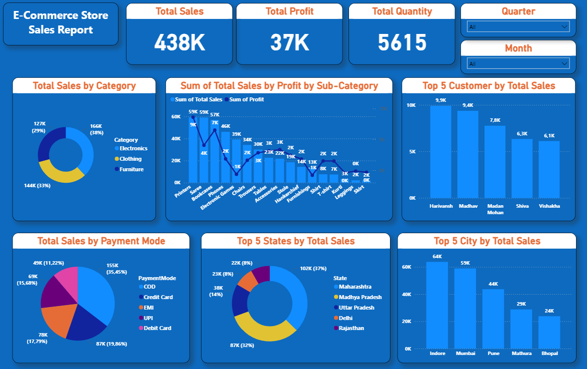

# 📊 Power BI Dashboards Repository

This repository contains five interactive Power BI dashboards covering domains such as banking, retail, e-commerce, marketing, and credit risk analysis. Each dashboard provides actionable insights and supports data-driven decision-making.

---

## 1️⃣ Bank Marketing Exploratory Data Analysis

Explores customer response to a bank's marketing campaigns with a focus on term deposit subscriptions.

- **Key Metrics**
  - Key Indicator: Term Deposit Subscription Rate
  - Data Scope: Contact type, age, job, marital status, housing, education

- **Core Analysis Areas**
  | Section | Description | Key Visuals |
  |--------|-------------|-------------|
  | Subscription Drivers | Subscription rate by **Job, Marital Status, Housing, Education** | Stacked Bar Charts |
  | Campaign Logistics | Contact type and subscription distribution by **Day & Month** | Bar & Area Charts |
  | Customer Profile | Age distribution and **Average Balance** by subscription | Bar & Pie Charts |
  | Time Factor | Analysis of **Duration of last contact** | Area Plot |

- **Data Sources:** Bank marketing campaign & customer demographics  
- **Technical Details:** Developed in **Power BI Desktop**, visualization-focused for EDA  

---

## 2️⃣ Super Store Sales Dashboard

Provides a complete overview of sales and profitability for a retail chain, with YoY comparisons.

- **Key Metrics**
  - Total Sales: **1.6M**
  - Total Profit: **175K**
  - Avg Delivery: **4 days**
  - Total Quantity: **22K**

- **Core Analysis Areas**
  | Section | Description | Key Visuals |
  |--------|-------------|-------------|
  | Growth Trends (YoY) | Monthly sales and profit comparison | Area Charts |
  | Customer & Regional Splits | Sales by segment & region | Donut Charts, Map |
  | Product & Fulfillment | Category & sub-category performance, Ship Mode | Bar Charts |
  | Payment Method | Sales distribution by payment type | Donut Chart |

- **Data Sources:** Transactional & Product/Customer Data  
- **Technical Details:** Developed in **Power BI Desktop**, interactive slicers for region-based filtering  

---

## 3️⃣ Marketing Performance Analytics Dashboard

Tracks digital marketing campaign performance with spend, revenue, ROI, and conversion metrics.

- **Key Metrics**
  - Revenue: **1.04M**
  - Total Spend: **261.2K**
  - Average ROI: **4.48**
  - Total Conversions: **2,531**
  - Total Clicks: **56K**
  - Average CTR: **13.86%**

- **Core Analysis Areas**
  | Section | Description | Key Visuals |
  |--------|-------------|-------------|
  | Channel Effectiveness | Revenue & spend per channel | Waterfall & Bar Charts |
  | Regional Performance | Revenue & spend by region & quarter | Bar & Area Charts |
  | Product Analysis | Revenue by product (Laptop, Tablet, etc.) | Donut Chart, Table |
  | Funnels | Marketing funnel (Impressions → Clicks → Conversions) | KPI Cards |

- **Data Sources:** Marketing APIs & CRM/Sales Data  
- **Technical Details:** Developed in **Power BI Desktop**, multi-dimensional analysis  

---

## 4️⃣ E-Commerce Store Sales Report

Executive summary of e-commerce store sales, revenue, and customer/geographic contributions.

- **Key Metrics**
  - Total Sales: **438K**
  - Total Profit: **37K**
  - Total Quantity: **5,615**

- **Core Analysis Areas**
  | Section | Description | Key Visuals |
  |--------|-------------|-------------|
  | Product Performance | Sales & profit by category/sub-category | Donut & Stacked Column Charts |
  | Customer & Geography | Top customers & contribution by state/city | Bar & Donut Charts |
  | Payment Analytics | Sales by payment mode | Donut Chart |
  | Filters | Time-based analysis by Quarter/Month | Slicer Filters |

- **Data Sources:** E-commerce transactional & master data  
- **Technical Details:** Developed in **Power BI Desktop**, high-density single-page dashboard  

---

## 5️⃣ Credit Risk Analysis Dashboard

Analyzes credit risk and lending portfolio performance for a bank, highlighting default rates and high-risk segments.

- **Key Metrics**
  - Total Amount of Loans: **312M**
  - Total Number of Loans: **32.58K**
  - Average Income: **66.07K**
  - Default Rate: **0.22**

- **Core Analysis Areas**
  | Section | Description | Key Visuals |
  |--------|-------------|-------------|
  | Risk Segmentation | Default rate by **Loan Grade (A-G)** | Bar Chart |
  | Loan Status & Distribution | Portfolio by **Loan Status (Default/Non-default)** | Donut Chart |
  | Customer Demographics | Home Ownership & Age Distribution | Donut Chart, Slicer |
  | Correlation Analysis | Loan Amount vs Income/Interest | Scatter Plots |

- **Data Sources:** Loan portfolio & customer credit data  
- **Technical Details:** Developed in **Power BI Desktop**, structured for risk management professionals  

---

## 📁 Folder Structure

Each dashboard has its dedicated folder and `.pbix` file:

| Dashboard | Folder Name | PBIX File Name |
|-----------|------------|----------------|
| Bank Marketing EDA | `Bank_Marketing_Analysis` | `Bank_Marketing_EDA_Term_Deposit.pbix` |
| Super Store Sales | `SuperStore_Sales_Dashboard` | `SuperStore_Sales_Performance.pbix` |
| Marketing Performance | `Marketing_Performance_Analytics` | `Marketing_Performance_Analytics.pbix` |
| E-Commerce Store | `ECommerce_Store_Sales` | `ECommerce_Store_Sales_Report.pbix` |
| Credit Risk Analysis | `Credit_Risk_Analysis` | `Credit_Risk_Analysis_Report.pbix` |

---

This repository showcases **Power BI expertise**, enables **interactive analysis**, and serves as a **portfolio of professional dashboards** across multiple business domains.
