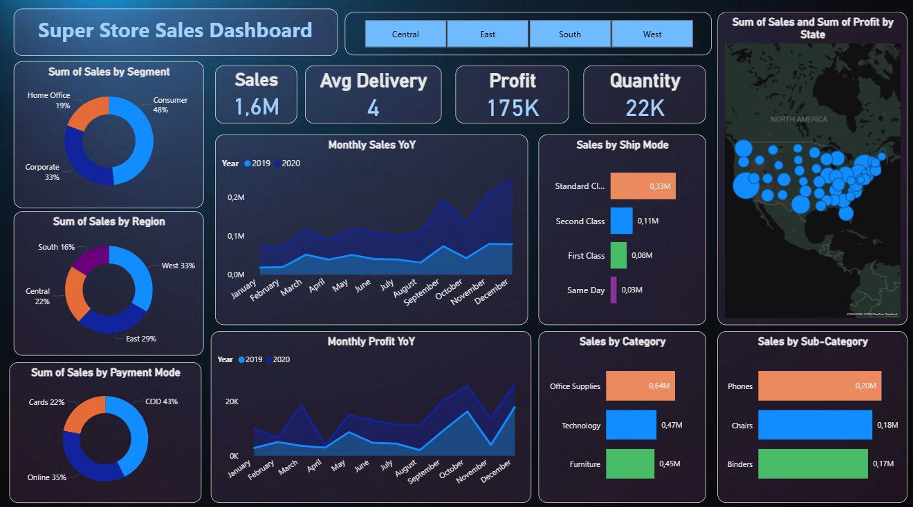

# 🏪 Super Store Sales Dashboard

This dashboard offers a comprehensive, interactive view of the Super Store's sales and profitability. It is designed for operational and strategic review, enabling users to analyze performance across geographical regions, customer segments, and product lines, with year-over-year (YoY) comparisons.

## Dashboard Key Metrics & Objectives

The primary goal of this dashboard is to monitor the overall health and growth trends of the business. The top-level KPIs provide an immediate snapshot of current performance.

- **Total Sales:** **1.6M**  
- **Total Profit:** **175K**  
- **Average Delivery:** **4** days  
- **Total Quantity:** **22K**  

## Core Analysis Areas

| Section | Description | Key Visuals |
|--------|-------------|-------------|
| **Growth Trends (YoY)** | Comparison of **Monthly Sales YoY** and **Monthly Profit YoY** across two years to identify seasonal trends and performance changes. | Area Charts |
| **Customer & Regional Splits** | Breakdown of sales contribution by **Customer Segment** (Consumer, Corporate, Home Office) and **Geographical Region** (Central, East, South, West). | Donut Charts, Map Visual |
| **Product & Fulfillment** | Analysis of sales performance across **Categories** and **Sub-Categories**. Tracks distribution by **Ship Mode**. | Bar Charts |
| **Payment Method** | Review of sales distribution based on the method of payment (Cards, COD, Online). | Donut Chart |

## Data Sources

- Super Store Transactional Data  
- Product and Customer Segment Data  

## Technical Details

This dashboard was developed using **Power BI Desktop**. It features four interactive buttons (Central, East, South, West) for filtering the entire view by region, demonstrating the use of bookmarks or slicers in Power BI for dynamic analysis.

---

## 📸 Dashboard Screenshot

